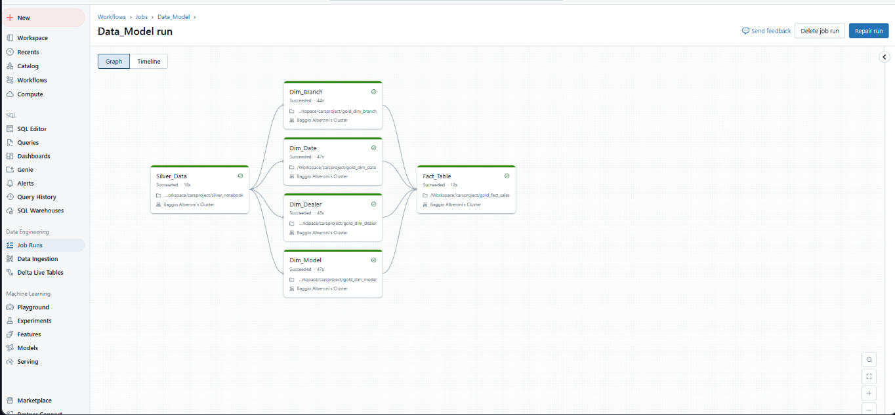

# Azure Data Engineering Project


## Dimension and Fact Modelling


## DataBricks Workflows


## 🚀 About the Project
This is a hands-on, real-world **Azure Data Engineering Project** designed to provide a deep understanding of building scalable and efficient data pipelines using modern cloud tools and techniques. The project is based on the **Medallion Architecture** (Bronze, Silver, Gold layers) and tackles complex, real-time data engineering challenges.

---

## 🔰 Key Features

### 🛠️ Tech Stack:
- **Azure Data Factory (ADF)**: For orchestrating and automating data workflows.
- **Databricks with Unity Catalog**: For data transformation and management.
- **Apache Spark**: For distributed data processing.
- **Delta Lake**: For managing data reliability and ACID transactions.
- **Azure Data Lake Gen2**: For scalable data storage.
- **Azure SQL Database**: For structured data storage.
- **GitHub**: For version control and collaboration.

### 🏗️ Architecture:
- **Medallion Architecture**:
  - **Bronze Layer**: Raw incremental data ingestion.
  - **Silver Layer**: Transformed and cleaned data.
  - **Gold Layer**: Optimized data with dimensional modeling.

### 🧩 Complex Real-Time Scenarios:
- Incremental Data Loading.
- Dimensional Data Modeling.
- STAR Schema Design.
- Slowly Changing Dimensions (SCDs).

---

## 📚 Learning Outcomes
This project is perfect for:
- Data Engineers who want to level up their skills.
- Professionals aiming to implement real-world scenarios in Azure.
- Beginners who want to dive into hands-on cloud projects.

---

## 🖥️ Architecture Breakdown

### Data Flow:
1. **Ingestion**: Data from an Azure SQL Database is ingested into Azure Data Lake using Azure Data Factory.
2. **Transformation**: Data is cleaned and transformed in Databricks, leveraging Apache Spark.
3. **Storage**:
   - Raw Data stored in **Bronze** layer (Parquet format).
   - Transformed Data stored in **Silver** layer (Parquet format).
   - Optimized and modeled data stored in **Gold** layer (Delta format).
4. **Reporting**: Data is visualized in **Power BI**, using STAR schema for efficient querying.
5. **Security**: Managed via Azure AD and Unity Catalog.

---

## 📊 Reporting with Power BI
The final STAR schema design enables efficient reporting and supports dashboards for business insights.

---

## 🧑‍💻 Getting Started
### Prerequisites
- Azure Subscription
- Databricks Workspace
- Power BI Desktop

### Setup Instructions
1. Clone this repository:
   ```bash
   git clone anmolgarg848/Azure-Databricks-E2E-Pipeline
   ```
2. Set up your Azure services as per the architecture.
3. Configure data ingestion pipelines in Azure Data Factory.
4. Use Databricks notebooks to perform transformations.
5. Load data into Azure SQL Database for reporting.
6. Connect Power BI to Azure SQL for dashboard creation.

---

## 🌟 Highlights
- End-to-end data engineering workflow.
- Real-world scenarios for learning and implementation.
- Integration of multiple Azure services.

---

## 🤝 Contributing
Feel free to fork this repository and contribute by submitting a pull request. We welcome enhancements, bug fixes, and new features.

---

## 📜 License
This project is licensed under the MIT License.

---

## 🙌 Acknowledgments
Special thanks to the Azure community for inspiration and support!
